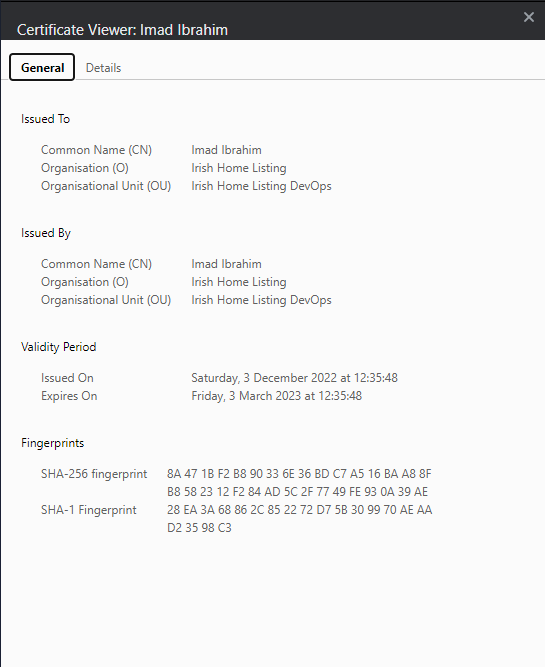
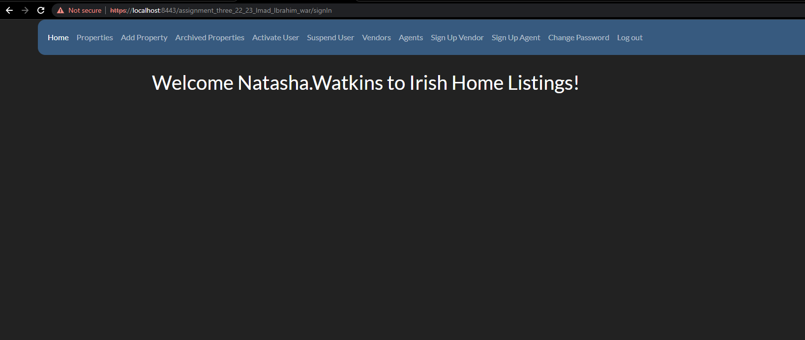

# assignment-three-Imad-Ibrahim

## Version One :smiley:

### Question one 
- It is implemented.
- SSL Certificate 
- 
- Before Clicking On Sign-in 
- 
- After I clicked on Sign-in 
- 
- -------------------------
- Before clicking on Signup 
- 
- After o clicked on Signup 
- 

### Question two
- It is done for all roles (Guest, User, Agent, and Admin).
- The code now has the SQLi and XSS.

### Question three
- All users are now authorized and authenticated.

- Guests (no authentication required).
- Registered users (authenticated with a username, password and active/suspend).
- Agents (authenticated with a username and password).
- Admin (agent with id 2 is an admin).

- The access matrix for the four users has been achieved 

### Question four
- All passwords are salted.
- Passwords are not transmitted in plain text between the browser and the server.
- The passwords' length is between 8 and 16 characters.
- when admin creates an agent account admin puts password for the new agent, but then agent can change the password at anytime.
- All passwords stored in the database are encrypted and salted.

# Usernames and passwords 
### Admin
- Natasha.Watkins -> natashapass
### Agent
- Sue.Roberts -> suerpass
- Chris.Clarkson -> chrispass
- Laura.Blain -> laurapass
- Dave.Lindale -> davepass
### User
- Caoimhe.Ryan -> caoimhepass
- John.Flynn -> johnpass
- Connor.Murphy -> connorpass
- Aoife.Kelly -> aoifepass
- Sean.Byrne -> seanpass